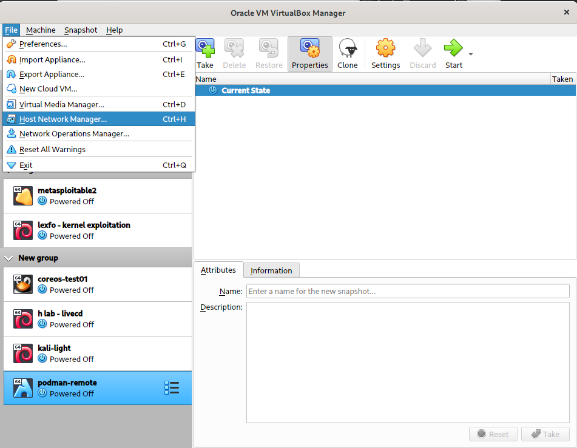
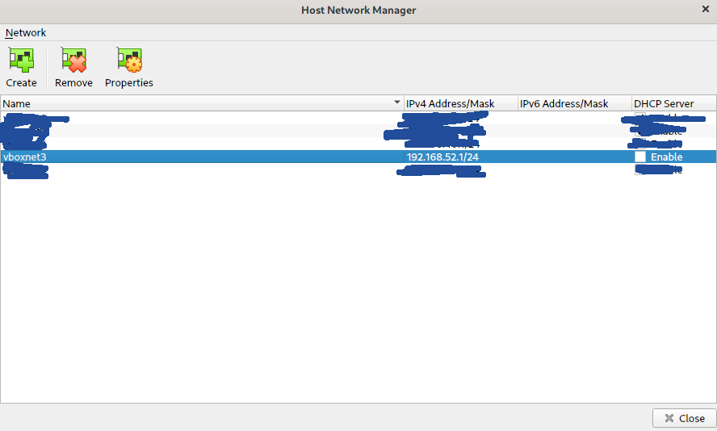
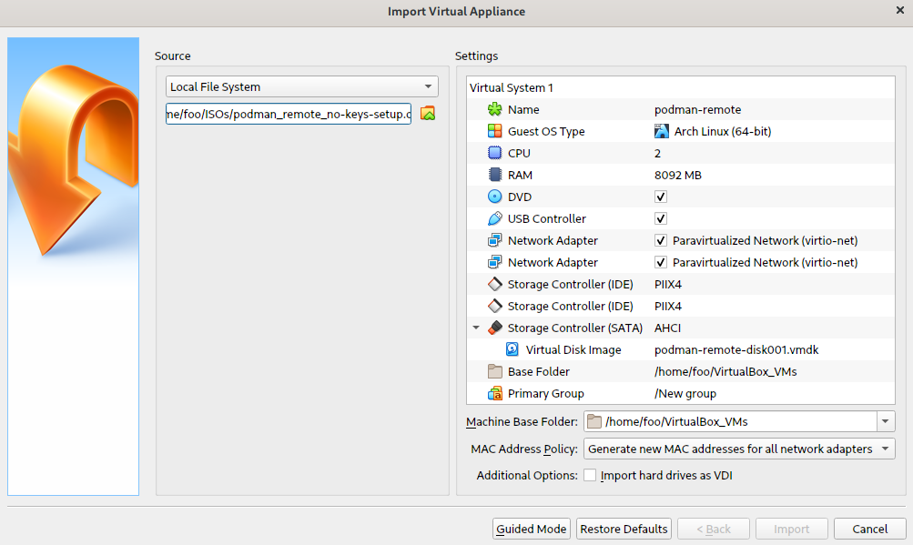

# Rootless Podman (Mac OS/Darwin)
Darwin is not able to run Linux containers on its own.
Thus you need a Linux VM as a container host, one option is to use Docker Desktop (uses *hyperkit* to provide hypervisor capabilities; no full-blown VM necessary).
However if you came to appreciate Podman on Linux there is no *default* way to install it.
This is what I am trying to provide.

***Important to note***:  
This setup does not support docker/podman host mounts on the "real host" (not guest VM) at the moment (if it will ever).  
As this setup uses a VirtualBox guest host mounts naturally occur on the guest machine. This is neither expected behavior for docker, nor podman. A user usally uses host mounts to modify or access files on his or her host machine.

The only way I can think of to provide host mounts is to mount the host's filesystem using the "vboxsf" kernel module.
The issue I am facing here is that configuration on Mac and Linux differs even for \$HOME.
Thus mounting /home/$USER (host) to /home/rootless (guest) is not a viable option.  
*Why would I want to do this?*  Think of `$ podman run -v ~/.ssh/id_rsa:/home/rootless/.ssh/id_rsa:ro archlinux bash`. This would allow a user to use a private key on his/her host without an explicit copy-command.

If anyone comes up with a way of mounting the host's filesystem inside the guest in a transparent way, please let me know.  

If I can make time I will try to accomplish a "transparent" mount at least for $HOME. (setting HOME to an alternate location when running a docker/podman command might do the trick? ... "-e HOME=/home/someotheruser")

## Install podman on your host
```
$ brew install podman
```

## VM image configuration (already done for you)

This image is as barebones as possible, have a look at the bash history if you wish (I did not clean it up).
Or do ```$ pacman -Q``` to list all packages.

For convenience reasons I installed *vim*.
Apart from that I had to install *git*, *go*, *yay* (a package manager for the Arch User Repository [AUR]) and a few other dependencies to install [fuse-overlayfs](https://aur.archlinux.org/packages/fuse-overlayfs/).
This filesystem abstraction should improve reads and writes inside containers.

### User and password
user: rootless  
password: rootless

User *rootless* has the following entry in */etc/sudoers*:
```
rootless ALL=(ALL) ALL
```

### Services explicitly enabled
```
[rootless@podman-remote ~]$ systemctl list-unit-files  | grep -i podman
io.podman.service                          enabled
io.podman.socket                           enabled
```

## How to run a podman host in VirtualBox

### Setup a vbox network interface for the podman remote

Click on *Host Network Adapter*, then add a vbox interface named *vboxnet3* with address and netmask:  
*192.168.52.1/24*, **do not enable DHCP**




<br>

### Download my Arch Linux image

[Image Link](https://drive.google.com/open?id=16Zj_DJiaNGDjLulWqYRHqs6zhm_Cdze6)  
sha256sum: *e312b781ee0f1d08ee9338d9cd4cf988f490f2bfc39a9a67df8c915b734693b9*  
sha512sum: *31de625fcde714897d3d3b05a2a47933914f57a7d55e3b4b32f9aa3ee05885f711fd85e674cf9519860c0ec9ff0cd1862db2d883abeecec9cddaa030c31e5bab*  

### Import the appliance


### Setup your ssh key for the podman remote

* On the **remote host** do:
    ```
    $ sudo vim /etc/ssh/sshd_config
    ```
    and ***uncomment*** the following lines:
    ```
    #PasswordAuthentication yes
    ```
    and
    ```
    #MaxAuthTries 100
    ```
    , then run ```$ sudo systemctl restart sshd```

    <br>

* On **your host**:
    ```
    # append the podman-remote to your hosts file
    $ echo '192.168.52.22 podman-remote' | sudo tee -a /etc/hosts
    ```

    ```
    # try to connect to the podman remote (password is "rootless")
    $ ssh rootless@podman-remote
    ```

    ```
    # generate a key for the remote
    $ ssh-keygen -f ~/.ssh/podman-remote -t ed25519 -C "podman-remote"

    # copy the key to the remote
    $ ssh-copy-id -i ~/.ssh/podman-remote rootless@podman-remote

    # try ssh-ing into the box again (it should not prompt you for a password now)
    $ ssh rootless@podman-remote
    ```


* On the **remote host**:
    ***comment*** the lines previously uncommented:
    ```
    PasswordAuthentication yes
    ```
    and
    ```
    MaxAuthTries 100
    ```
    , then run
    ```
    $ sudo systemctl restart sshd
    ```


<br>

### Configure podman to use the remote host you just configured


* run podman with a remote Linux host:
    ```
    $ podman --remote-host podman-remote --username rootless <cmd>
    ```


* to statically configure podman to use a remote host, write the contents below to ***~/.config/containers/podman-remote.conf***:
    ```
    # ~/.config/containers/podman-remote.conf
    [connections]
        [connections.host1]
        destination = "podman-remote"
        username = "rootless"
        default = true
    ```
    , then try:
    ```
    $ podman <cmd>
    ```

<br>

### To turn the VM off, simply do:
```
$ poweroff
```

### To update the remote host do:
```
$ sudo pacman --noconfirm -Syyu; yay --noconfirm -Syua
```
