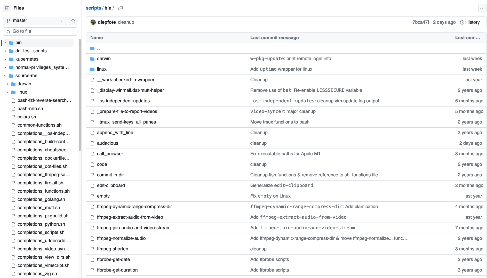

Terminal Config

#### Table of contents

- [dot-files](#dot-files)
- [bash script & source-me collection](#bash-script--source-me-collection)
- [golang-tools](#golang-tools)
    - [use in tmux](#use-in-tmux)
- [rust-tools](#rust-tools)
- [python-tools](#python-tools)
    - [extend kubectl bash completions/extend oc bash completions](#extend-kubectl-bash-completions)
    - [miscellaneous](#miscellaneous)
- [vimscript](#vimscript)
- [git](#git)
    - [git resubmit](#git-resubmit)
    - [git get-upstream](#git-get-upstream)

# dot-files

The config I use is split among several repos.
The main config resides in the [dot-files repo](https://github.com/diepfote/dot-files).  
It references the [scripts repo](#bash-script--source-me-collection) which in
turn references the [python-tools](#python-tools), [golang-tools](#golang-tools)
and [rust-tools](#rust-tools) repos.

* [repo](https://github.com/diepfote/dot-files)
* [tmux config](https://github.com/diepfote/dot-files/blob/aed558943e888cc6b32eacdb9f64ca687f358869/.tmux.conf)

# bash script & source-me collection

[repo](https://github.com/diepfote/scripts)

This repo contains the following in the root of the repository:

* general scripts that will be referenced directly (not on the PATH): An example would be the `i3cat-audio-device-helper.sh` for my [i3 config](../tiling-window-managers/index.html#statusbar-config).
* scripts for use in PATH in the `bin/` folder
* files in the `source-me/` folder that are meant to be used with `source <file>`:  completion config, functions rather than executables, aliases and global variables
* [kubernetes plugins (etc)](https://github.com/diepfote/scripts/tree/852787d5968e0c3b58826fd855e30635729d473b/kubernetes) in `kubernetes/`

### bin

Scripts used as wrappers (e.g. git wrapper) or additional executables.  
The `bin/` folder contains additional folders for
executables that might not want to be used on every system.
It distinguishes between Mac OS and Linux.



# golang-tools

[repo](https://github.com/diepfote/golang-tools)

Tools where I care about speed are not written in bash or python.
I instead tried go, zig and rust. For most of them I stuck to go.
I never considered c++ as I am not a fan and abstained from c as it
is harder to port between systems than aforementioned languages.

#### Use in tmux

Pane-border now displays the current git branch and whether it is in sync with the upstream branch (based on the last `git fetch`).  
Statusbar-right is used to display the current kubernetes cluster and openstack project.

* [pane-border](https://github.com/diepfote/dot-files/blob/aed558943e888cc6b32eacdb9f64ca687f358869/.tmux.conf#L51)
* [statusbar-right](https://github.com/diepfote/dot-files/blob/aed558943e888cc6b32eacdb9f64ca687f358869/.tmux.conf#L44)

# python-tools

[repo](https://github.com/diepfote/python-tools)

As I am intimately familiar with python it is my go to programming language.
If the tasks cannot be accomplished in a scripting language easily and I
do not care about speed or I need it now, I will write it in python.

#### extend kubectl bash completions

Kubectl does not provide functionality to add completions for
[krew plugings](https://krew.sigs.k8s.io/plugins/) or [hand-rolled plugins](https://github.com/diepfote/scripts/tree/852787d5968e0c3b58826fd855e30635729d473b/kubernetes/bin) (`kubectl-x_y_z` executable files). 
This is my [remedy](./kubectl-bash-completion-patching/index.html).

#### miscellaneous

Here is a list of several things I needed or wanted to have: 

* [display ics calender files in plaintext](https://github.com/diepfote/python-tools/blob/2fef3537b26f8ce2b3019797460f5debbe9e17c4/show-ics.py)
* [convert latex editor Gummi snippets to Gedit snippets](https://github.com/diepfote/python-tools/blob/2fef3537b26f8ce2b3019797460f5debbe9e17c4/convert_gummi_snippets_to_gedit_snippets.py)
* [read toml setting](https://github.com/diepfote/python-tools/blob/f8a4e088de5e0b4b1694229f0162015adc9259a9/read_toml_setting.py)
* [urldecode/-encode](https://github.com/diepfote/python-tools/blob/5a79fd259c11ba860891b499a920e88b0fdda235/urlquoting.py)
* [regex substitution](https://github.com/diepfote/python-tools/blob/9c13477200e1db17c8768a328e2699437baf856f/regex-substitute.py)

# rust-tools

So far I only wrote a bash helper. It displays the current PATH and active .venv.
It then colors and shortens them so they are still readable if there are several tmux panes.  
After trying go and zig I decided to see if rust would be even faster for the task.
I am sticking to it for now.  
I override the PROMPT_COMMAND [here](https://github.com/diepfote/scripts/blob/32000c108f5a6498b1c721151dee667adf078092/source-me/prompt.sh#L30).
Thus, anytime you hit Enter the PROMPT_COMMAND will use the [_ps1](https://github.com/diepfote/scripts/blob/32000c108f5a6498b1c721151dee667adf078092/source-me/prompt.sh#L30) function to set the `PS1` variable.
This variable is used by bash to display information on every prompt e.g. the current path.

# vimscript

Please refer to [projects in vimscript](../projects/index.html#vimscript).  
My vim config: [repo](https://github.com/diepfote/.vim)

# git

### Git functionality extensions

I decided to stick to plain git config for most functionality instead of writing separate bash helpers.
The ones I use most often are `git find-commits-changed-file`, `git resubmit`, `git get-upstream`: link to [aliases](https://github.com/diepfote/dot-files/blob/a2e4b1cc6bfe470d1c75760cb59665fec2b5c1ca/.gitconfig#L13)  

#### git resubmit

* `git add` the files you specified as parameters to the staging area
* run `git commit --amend --no-edit`
* run `git push --force-with-lease`, if you require `--force` use `git resubmit-force`

Note that `git redo` is also available, it does the same thing but stops short of pushing to the repo.

#### git get-upstream

* Runs `git update`, which moves to `master` and `git pull`s it. Should this fail it runs a `git fetch origin/master` only.
* It moves back to the previous branch
* It runs `git rebase master`

TL;DR: Rebases current branch onto `origin/master`

#### Rarely used but gems if you need them

* `git list-all-files-ever-tracked` and `git reflog-list-all-files-ever-tracked`: sometimes you are looking for an old file and you half-remember its path...
* `git content-grep` and `git log-grep`: look for part of a file across the history of the entire repo. Or for a certain commit message...


### Fast access to various repos

For faster access to the numerous git repos I use for my config I set up bash functions to operate on them from any path. 
These jump to these repos/files directly: [general](https://github.com/diepfote/scripts/blob/3ac0081bbf178b4f9e630513e51c87bd8eee7527/source-me/posix-compliant-shells.sh#L589), [linux only](https://github.com/diepfote/scripts/blob/703963f7ace80a5b61e182b09cb0884e547be436/source-me/linux/posix-compliant-shells.sh#L179)  
All of these use custom completion rules 
(if you hit tab bash will provide a list of files
in the actual repo, not the current directory).
This is an [example](https://github.com/diepfote/scripts/blob/32000c108f5a6498b1c721151dee667adf078092/source-me/completions_golang.sh)
of how these completions are set up.

Examples are:

<p><details>

```text
edit-script
log-script
commit-script
reset-script
diff-script
status-script
edit-go
log-go
commit-go
reset-go
diff-go
status-go
```

</details></p>

