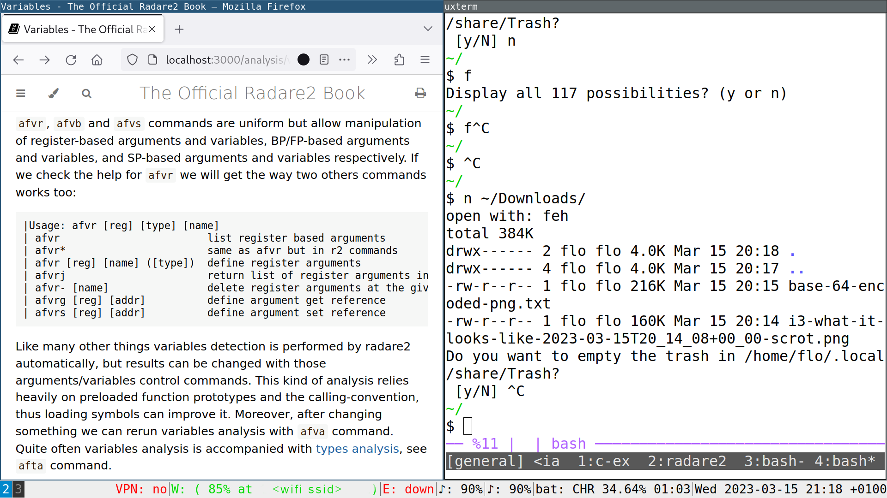

Tiling window managers config

#### Table of contents

1. [Darwin / Mac OS](#darwin--mac-os)
    - [Window manager](#window-manager)
    - [Hotkeys / Key bindings](#hotkeys--key-bindings)
2. [Linux](#linux)
    - [Main config](#main-config)
    - [Statusbar config](#statusbar-config)

# Darwin / Mac OS

## Window manager

I used to use skhd + yabai but this requires security downgrades on Mac OS.
I have since switched to [Amethyst](https://ianyh.com/amethyst/).
Make no mistake, this is no i3 but [yabai](https://github.com/koekeishiya/yabai) never was either.

## Hotkeys / Key bindings

I use [Karabiner-Elements](https://github.com/pqrs-org/Karabiner-Elements) a keyboard customizer for macOS.  
My config lives [here](https://github.com/diepfote/dot-files/tree/5336f08674e4653064f802168e96834cc7f1310d/.config/karabiner).

# Linux

I use [i3](https://github.com/Airblader/i3).  
The config can be found in the sections below.

--

What it looks like

## Main config

This config sets hotkeys and workspace (virtual desktops) config.
It also configures an i3 statusbar helper.

The main config can be found [here](https://github.com/diepfote/dot-files/blob/79ab2e985900f60888de119171d02056c4f29231/.config/i3/config).

*Sidenote*: i3 startup is handled via [.xinitrc](https://github.com/diepfote/dot-files/blob/61fc984f9b7f332503755766a46bc5a84a58ff04/.xinitrc)

## Statusbar config

* The config uses an extra tool instead of plain `i3status`: [`i3cat`](https://vincent-petithory.github.io/i3cat/)
* The main `i3cat` config lives [here](https://github.com/diepfote/dot-files/blob/011fa649ff02a2e470b3e495a903e65fc891c72f/.config/i3cat/config)
* The config above uses two [i3status](https://i3wm.org/i3status/manpage.html) processes plus a [separate script](https://github.com/diepfote/scripts/blob/91f7ac81f969e8158aedb6dea6662eefeead2a8c/i3cat-audio-device-helper.sh) to display audio levels.
* The config for those `i3status` processes can be found [here](https://github.com/diepfote/dot-files/tree/b45e108a685225bdecd0dd2bd89f5beaf0ca45b9/.config/i3status).

